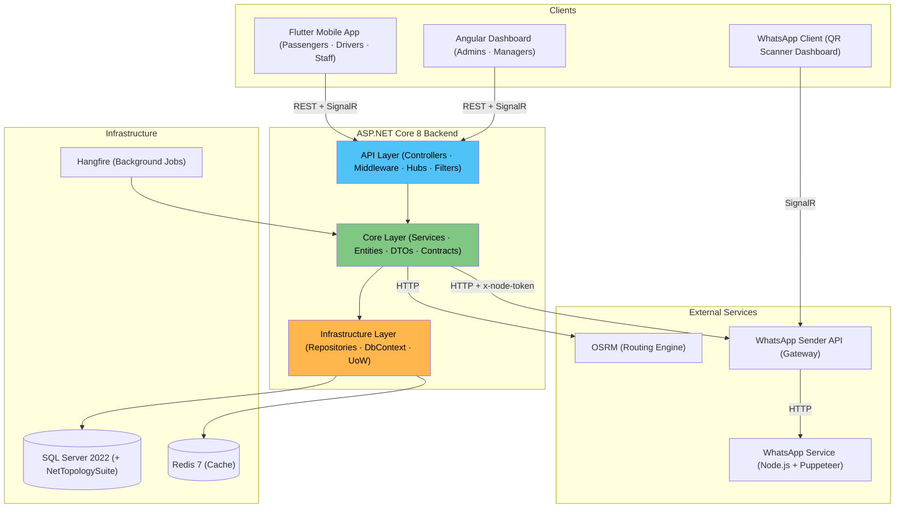
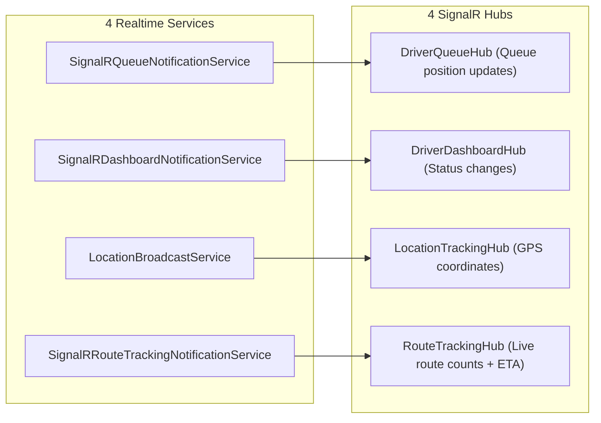
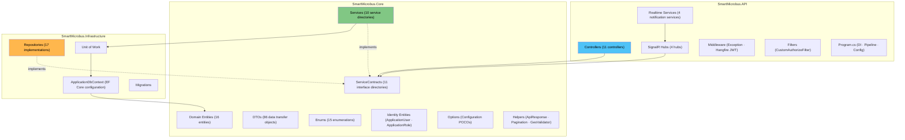
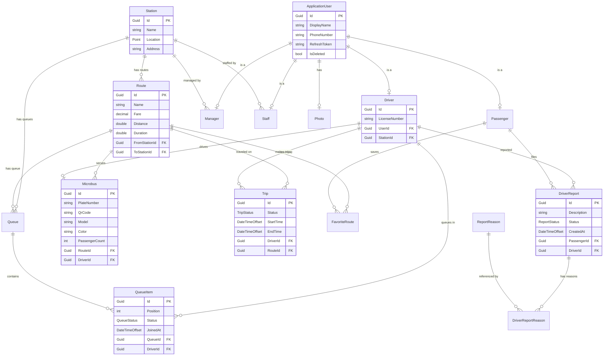
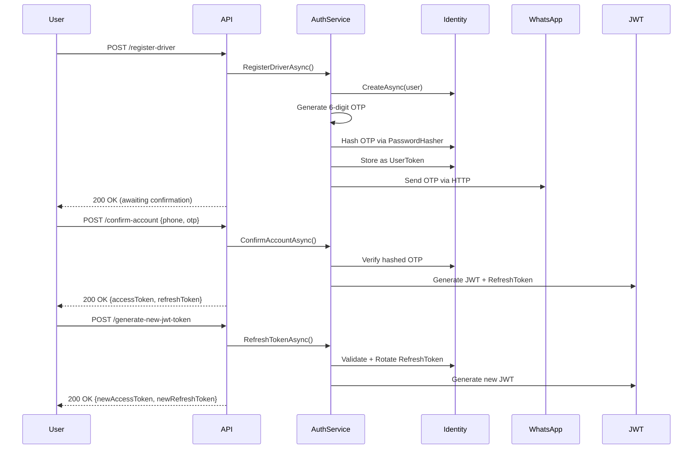
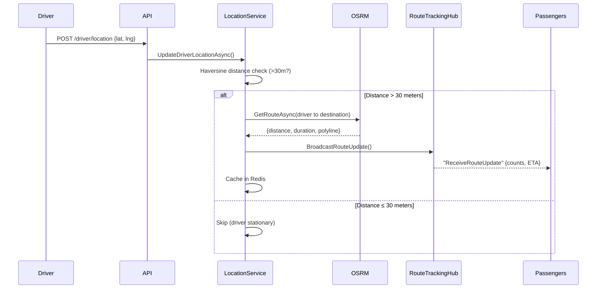
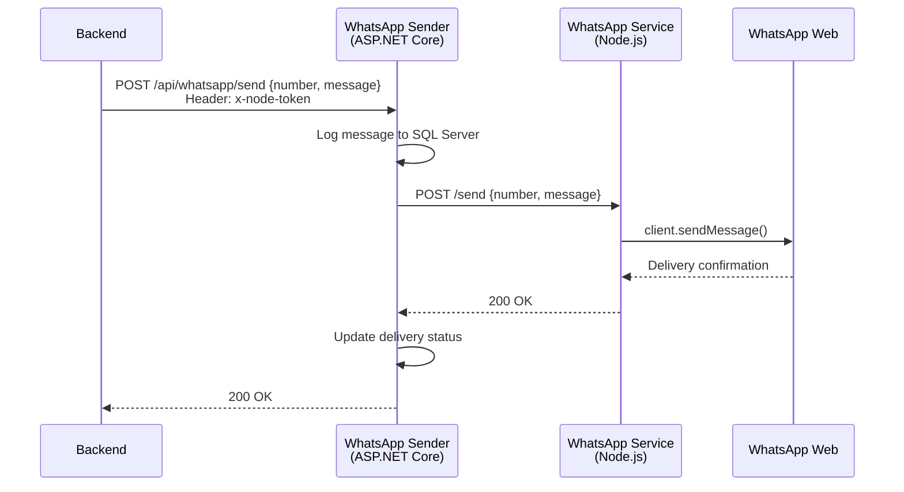
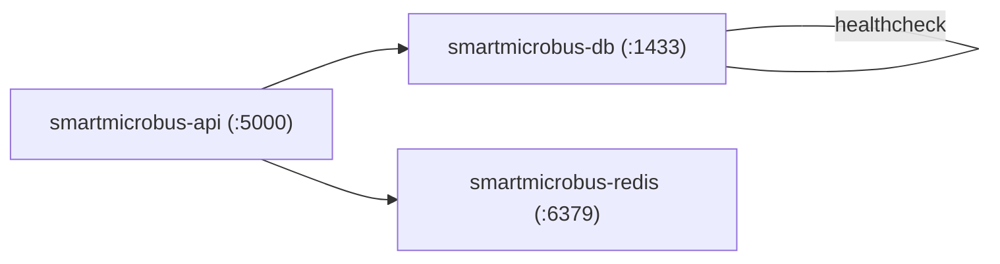

# Wasla — Smart Microbus Management Platform

[](https://opensource.org/licenses/MIT)
[](https://dotnet.microsoft.com/)
[](https://www.docker.com/)
[]()
[](http://makeapullrequest.com)

> A production-grade, real-time transportation management system built with ASP.NET Core 8 and Clean Architecture.

Wasla digitizes Egypt's informal microbus transit system — replacing paper-based station management with real-time GPS tracking, encrypted QR operations, automated trip lifecycle management, and WhatsApp-powered OTP authentication.

---

## Live Links

Explore the live production environment of the Wasla platform:

- **[Swagger API Documentation](https://smart-microbus.runasp.net/swagger/index.html)** - Explore and test the ASP.NET Core REST APIs.
- **[Admin Dashboard](https://smartmicrobus.web.app/overview)** - The web-based station management portal built with Angular.
- **[Mobile App Download](https://smart-microbus.runasp.net/app/)** - Download the Flutter-based passenger and driver application.

---

## Table of Contents

- [Live Links](#live-links)
- [The Problem We Solve](#the-problem-we-solve)
- [The Solution & Features](#the-solution--features)
- [Project Ecosystem](#project-ecosystem)
- [Architecture Overview](#architecture-overview)
- [Tech Stack](#tech-stack)
- [Clean Architecture](#clean-architecture)
- [Domain Model](#domain-model)
- [Authentication & Authorization](#authentication--authorization)
- [API Reference](#api-reference)
- [SignalR Real-Time Hubs](#signalr-real-time-hubs)
- [Background Jobs](#background-jobs)
- [Key Engineering Decisions](#key-engineering-decisions)
- [WhatsApp Integration](#whatsapp-integration)
- [Docker Deployment](#docker-deployment)
- [Getting Started](#getting-started)
- [Environment Variables](#environment-variables)
- [Project Structure](#project-structure)

---

## The Problem We Solve

Every day in Egypt, over **14 million people** rely on informal microbuses for transportation. Despite being the backbone of public transit, the system operates almost entirely manually using paper notebooks and verbal communication.

This creates massive inefficiencies across the board:

- **For Passengers:** No visibility into bus availability. Passengers don't know if they will wait 5 minutes or an hour, cannot track incoming buses, and frequently fall victim to overcharging because official fares aren't digitized.
- **For Drivers:** Wasted hours sitting in unmanaged queues without knowing their exact turn. Disputes frequently break out over line-cutting and manual queue mismanagement.
- **For Station Staff:** Managing hundreds of vehicles daily with paper notebooks leads to slow dispatch times, human error, and chaos at the station gates.
- **For Management:** Zero live visibility. Managers cannot see how many trips are completed, whether the station is running at capacity, or track passenger complaints.

**Wasla** was built to solve this by introducing real-time tracking, digital queues, encrypted QR authentication, and automated workflows to an industry that has operated offline for decades.

---

## The Solution & Features

Wasla digitizes the entire microbus transportation workflow, offering dedicated applications and dashboards tailored to each role:

- **Passengers:** View available microbuses at any station, track incoming buses in real time on a live map, and see exact ETAs and official fares. Passengers can find the nearest station, save favorite routes, and file reports against driver misconduct.
- **Drivers:** Gain full visibility into their exact queue position. Drivers know exactly who is ahead of them and their estimated wait time. They check in and check out using encrypted QR codes—eliminating paper and verbal arguments.
- **Station Staff:** Manage the queue digitally. When a driver scans their QR code at the gate, the system automatically validates the token, updates the queue, and creates a trip. No manual data entry needed.
- **Station Managers:** Access a comprehensive web dashboard with live analytics, real-time monitoring, trip reports, driver management, and a complete reporting system to resolve passenger complaints.
- **System Admins:** Have full control over the platform's infrastructure. Admins can create and manage stations (update names, map locations, or perform soft deletes), register station managers, reassign managers between stations, monitor background scheduled tasks via the Hangfire dashboard, and manage the WhatsApp messaging infrastructure (authenticating and monitoring the Node.js sender engine via the dedicated WhatsApp dashboard).

---

## Project Ecosystem

This repository is the central backend API for the Wasla platform. The complete system is a distributed ecosystem consisting of multiple specialized applications and microservices.

### Related Repositories

| Repository              | Description                              | Link                                                                       |
| ----------------------- | ---------------------------------------- | -------------------------------------------------------------------------- |
| **Backend** (This Repo) | Main ASP.NET Core backend                | [GraduationProject](https://github.com/Ibrahim-Hassan74/GraduationProject) |
| **Dashboard**           | Angular management dashboard             | [smart-bus-web](https://github.com/Mustafa-Mo7amed/smart-bus-web)          |
| **Mobile**              | Flutter passenger and driver application | [smart-microbus](https://github.com/a7medhosny/smart-microbus)             |
| **WhatsApp Sender**     | ASP.NET Core messaging gateway           | [whatsapp-sender](https://github.com/Ibrahim-Hassan74/whatsapp-sender)     |
| **WhatsApp Service**    | Node.js headless WhatsApp engine         | [whatsapp-service](https://github.com/Ibrahim-Hassan74/whatsapp-service)   |
| **WhatsApp Dashboard**  | Angular WhatsApp dashboard               | [whatsapp-dashboard](https://github.com/Ibrahim-Hassan74/whatsapp-client)  |

---

## Architecture Overview



### System Component Diagram



---

## Tech Stack

| Category             | Technologies                                                         |
| :------------------- | :------------------------------------------------------------------- |
| **Runtime**          | ASP.NET Core 8, C# 12, .NET 8                                        |
| **Database**         | SQL Server 2022, Entity Framework Core 8, NetTopologySuite (Spatial) |
| **Cache**            | Redis 7 (distributed), IMemoryCache (in-process)                     |
| **Real-Time**        | SignalR WebSockets (4 hubs)                                          |
| **Auth**             | ASP.NET Identity, JWT (HMAC-SHA256), Refresh Token Rotation          |
| **Background Jobs**  | Hangfire with SQL Server Storage + Hangfire.Console                  |
| **Routing Engine**   | OSRM (Open Source Routing Machine)                                   |
| **Security**         | AES-GCM Encryption, bcrypt OTP Hashing, Rate Limiting                |
| **Containerization** | Docker, Docker Compose, Multi-Stage Builds                           |
| **API Design**       | RESTful, API Versioning (v1/v2), Swagger/OpenAPI                     |
| **Reporting**        | ClosedXML (Excel Generation)                                         |
| **Image Processing** | SixLabors.ImageSharp                                                 |
| **Mapping**          | AutoMapper                                                           |
| **Localization**     | IStringLocalizer + .resx (Arabic/English)                            |
| **Logging**          | Serilog                                                              |

---

## Clean Architecture



### Layer Rules

| Layer              | Depends On | Never Depends On          |
| :----------------- | :--------- | :------------------------ |
| **API**            | Core       | Infrastructure (directly) |
| **Core**           | Nothing    | API, Infrastructure       |
| **Infrastructure** | Core       | API                       |

---

## Domain Model



### Enumerations

| Enum                    | Values                                          | Used In                   |
| :---------------------- | :---------------------------------------------- | :------------------------ |
| `UserRole`              | Admin, Manager, Staff, Driver, Passenger, Owner | JWT claims, `[Authorize]` |
| `DriverDashboardStatus` | Available, InQueue, OnTrip                      | Driver mobile app         |
| `QueueStatus`           | Waiting, YourTurn, Skipped, InTrip              | Queue management          |
| `TripStatus`            | Started, Completed, Cancelled                   | Trip lifecycle            |
| `ReportStatus`          | Pending, Reviewed                               | Complaint resolution      |
| `TransportMode`         | Driving, Walking                                | OSRM route queries        |

---

## Authentication & Authorization



### JWT Claims

| Claim                  | Source                 | Purpose                   |
| :--------------------- | :--------------------- | :------------------------ |
| `sub` (NameIdentifier) | User.Id                | User identification       |
| `role`                 | ASP.NET Identity Roles | RBAC authorization        |
| `StationId`            | Manager/Staff entity   | Station-scoped operations |
| `jti`                  | New GUID per token     | Token uniqueness          |

### Authorization Matrix

| Endpoint Group             | Admin | Manager | Staff | Driver | Passenger | Anonymous |
| :------------------------- | :---: | :-----: | :---: | :----: | :-------: | :-------: |
| Account (register, login)  |       |         |       |        |           |    ✅     |
| Admin (users, managers)    |  ✅   |         |       |        |           |           |
| Manager (CRUD, dashboard)  |       |   ✅    |       |        |           |           |
| Staff (check-in/out)       |       |         |  ✅   |        |           |           |
| Driver (location, history) |       |         |       |   ✅   |           |           |
| Reports (create)           |       |         |       |        |    ✅     |           |
| Reports (admin view)       |       |   ✅    |       |        |           |           |
| Routes (read)              |       |         |       |        |           |    ✅     |
| Stations (read)            |       |         |       |        |           |    ✅     |

---

## API Reference

### Account (`/api/v1/Account`)

| Method | Endpoint                  | Auth   | Description                 |
| :----- | :------------------------ | :----- | :-------------------------- |
| POST   | `/register-driver`        | —      | Register new driver         |
| POST   | `/register-passanger`     | —      | Register new passenger      |
| POST   | `/login`                  | —      | Login with phone + password |
| POST   | `/confirm-account`        | —      | Confirm with OTP            |
| POST   | `/resend-confirmation`    | —      | Resend OTP                  |
| POST   | `/forgot-password`        | —      | Initiate password reset     |
| POST   | `/verify-otp`             | —      | Verify reset OTP            |
| POST   | `/reset-password`         | —      | Set new password            |
| POST   | `/generate-new-jwt-token` | —      | Refresh JWT                 |
| POST   | `/logout`                 | Bearer | Invalidate refresh token    |
| GET    | `/me`                     | Bearer | Get current user profile    |
| PATCH  | `/upload-photo`           | Bearer | Upload profile photo        |
| DELETE | `/delete-photo`           | Bearer | Remove profile photo        |
| DELETE | `/delete`                 | Bearer | Soft delete account         |

### Driver (`/api/v1/Driver`)

| Method | Endpoint                   | Auth    | Description               |
| :----- | :------------------------- | :------ | :------------------------ |
| GET    | `/{driverId}`              | Manager | Get driver by ID          |
| GET    | `/license/{licenseNumber}` | Manager | Get driver by license     |
| GET    | `/get-current-postion`     | Driver  | Get dashboard status      |
| GET    | `/get-driver-queue`        | Driver  | Get queue position        |
| POST   | `/end-trip`                | Driver  | End active trip           |
| GET    | `/history`                 | Driver  | Paginated trip history    |
| GET    | `/get-by-plate-number`     | —       | Lookup by plate           |
| POST   | `/location`                | Driver  | Update GPS location       |
| GET    | `/location/{driverId}`     | Auth    | Get driver location + ETA |

### Staff (`/api/v1/Staff`)

| Method | Endpoint     | Auth  | Description           |
| :----- | :----------- | :---- | :-------------------- |
| POST   | `/check-in`  | Staff | QR scan → join queue  |
| POST   | `/check-out` | Staff | QR scan → create trip |

### Manager (`/api/v1/Manager`)

| Method | Endpoint                     | Auth    | Description                |
| :----- | :--------------------------- | :------ | :------------------------- |
| POST   | `/add-driver`                | Manager | Register driver to station |
| POST   | `/add-microbus`              | Manager | Add microbus               |
| PUT    | `/update-microbus/{id}`      | Manager | Update microbus            |
| DELETE | `/delete-microbus/{id}`      | Manager | Remove microbus            |
| POST   | `/assign-driver-microbus`    | Manager | Link driver ↔ microbus     |
| GET    | `/dashboard/overview`        | Manager | Station dashboard stats    |
| GET    | `/station-drivers`           | Manager | Paginated drivers          |
| POST   | `/station-staff`             | Manager | Add staff member           |
| PUT    | `/station-staff/{id}`        | Manager | Update staff               |
| DELETE | `/station-staff/{id}`        | Manager | Remove staff               |
| GET    | `/station-staff`             | Manager | Paginated staff            |
| GET    | `/export-station-data`       | Manager | Excel: trips by date range |
| GET    | `/export-station-drivers`    | Manager | Excel: all station drivers |
| GET    | `/export-station-routes`     | Manager | Excel: all station routes  |
| GET    | `/export-station-microbuses` | Manager | Excel: all microbuses      |
| GET    | `/export-reports`            | Manager | Excel: reports             |
| POST   | `/check-in`                  | Manager | QR scan (manager role)     |
| GET    | `/{driverId}/driver-history` | Manager | View any driver's history  |

### Routes (`/api/v1/Routes`)

| Method | Endpoint                        | Auth    | Description                    |
| :----- | :------------------------------ | :------ | :----------------------------- |
| GET    | `/`                             | —       | All routes (location data)     |
| GET    | `/all`                          | Manager | Paginated routes for station   |
| GET    | `/destinations`                 | —       | Destinations from a station    |
| GET    | `/{routeId}/summary`            | —       | Route summary (fare, distance) |
| GET    | `/{routeId}/station-microbuses` | —       | Available microbuses           |
| GET    | `/{routeId}/on-the-way`         | —       | Incoming microbuses            |
| GET    | `/route`                        | —       | OSRM route between coordinates |
| POST   | `/add-route`                    | Manager | Create route                   |
| PATCH  | `/update-route`                 | Manager | Update route                   |
| DELETE | `/delete-route`                 | Manager | Delete route                   |

### Stations (`/api/v1/Stations`)

| Method | Endpoint                   | Auth  | Description                        |
| :----- | :------------------------- | :---- | :--------------------------------- |
| GET    | `/`                        | —     | All stations                       |
| GET    | `/{id}`                    | —     | Station by ID                      |
| GET    | `/nearest`                 | —     | Nearest station (lat, lng, mode)   |
| GET    | `/{id}/details-with-route` | —     | Station + route from user location |
| GET    | `/route-between`           | —     | Route between two stations         |
| POST   | `/`                        | Admin | Add station                        |
| PUT    | `/{id}`                    | Admin | Update station                     |
| DELETE | `/{id}`                    | Admin | Delete station                     |

### Reports (`/api/v1/Report`)

| Method | Endpoint             | Auth      | Description                  |
| :----- | :------------------- | :-------- | :--------------------------- |
| POST   | `/`                  | Passenger | File complaint               |
| GET    | `/`                  | Passenger | My reports (paginated)       |
| GET    | `/{id}`              | Passenger | Report details               |
| PUT    | `/{id}`              | Passenger | Update report                |
| DELETE | `/{id}`              | Passenger | Delete report                |
| GET    | `/reasons`           | —         | Available report reasons     |
| GET    | `/admin/all`         | Manager   | All reports for station      |
| GET    | `/admin/{id}`        | Manager   | Report detail (manager view) |
| PATCH  | `/admin/{id}/status` | Manager   | Update report status         |

### Admin (`/api/v1/Admin`)

| Method | Endpoint                 | Auth  | Description                |
| :----- | :----------------------- | :---- | :------------------------- |
| POST   | `/add-manager`           | Admin | Create station manager     |
| GET    | `/users`                 | Admin | All users (paginated)      |
| GET    | `/users/{id}`            | Admin | User by ID                 |
| POST   | `/users/{id}/lock`       | Admin | Lock account               |
| POST   | `/users/{id}/unlock`     | Admin | Unlock account             |
| DELETE | `/managers/{id}`         | Admin | Delete manager             |
| PUT    | `/managers/{id}/station` | Admin | Reassign manager's station |

---

## SignalR Real-Time Hubs

### Hub Endpoints

| Hub                   | Path                      | Auth         | Purpose                       |
| :-------------------- | :------------------------ | :----------- | :---------------------------- |
| `DriverQueueHub`      | `/hubs/driver-queue`      | Driver (JWT) | Queue position updates        |
| `DriverDashboardHub`  | `/hubs/driver-dashboard`  | Driver (JWT) | Status change notifications   |
| `LocationTrackingHub` | `/hubs/location-tracking` | —            | Live GPS tracking             |
| `RouteTrackingHub`    | `/hubs/route-tracking`    | —            | Route-level live counts + ETA |

### SignalR Event Flow



---

## Background Jobs

| Job                    | Schedule                     | Description                                                  |
| :--------------------- | :--------------------------- | :----------------------------------------------------------- |
| **Daily Queue Reset**  | Midnight (Cairo time, UTC+2) | Resets all driver queues using `ExecuteInTransactionAsync()` |
| **Trip Auto-Complete** | Delayed (per trip)           | Marks trip as Completed after estimated travel time          |

---

## Key Engineering Decisions

### AES-GCM Encrypted QR Tokens

Each driver's QR code is an AES-GCM encrypted payload containing `{DriverId, MicrobusId, RouteId, Expiration}`. Staff scan it → decrypt → validate → create trip, all in one atomic operation with 4 SignalR broadcasts.

### OSRM-Powered ETA with Return Trip Caching

GPS updates trigger OSRM routing queries. Return trip durations are cached (4 hours TTL) to minimize API calls. Updates under 30m are silently dropped via Haversine formula.

### Bidirectional Route Notifications

When a bus checks in/out, both departure and arrival route subscriber groups receive live count updates via `SignalRRouteTrackingNotificationService`.

### Soft Delete with Phone Namespacing

Deleted accounts have their phone prefixed with `DELETED_{userId}_`, freeing the number for reuse while preserving audit trail.

### Standardized API Response Envelope

Every endpoint returns `ApiResponse` / `ApiResponseWithData<T>` through `ApiResponseFactory`, ensuring consistent error handling across all clients.

### Global Exception Handling + Security Headers

`ExceptionHandlingMiddleware` catches all unhandled exceptions, applies security headers (`X-Content-Type-Options`, `X-XSS-Protection`, `X-Frame-Options`), and returns localized error messages.

---

## WhatsApp Integration



See [`whatsapp-sender/README.md`](../whatsapp-sender/README.md), [`whatsapp-service/README.md`](../whatsapp-service/README.md), and [`whatsapp-client/README.md`](../whatsapp-client/README.md) for full documentation.

---

## Docker Deployment

```yaml
# docker-compose.yml — 3 services
services:
  api: # ASP.NET Core 8 → port 5000
  sqlserver: # SQL Server 2022 → port 1433 (healthcheck)
  redis: # Redis 7 Alpine → port 6379
```



---

## Getting Started

### Prerequisites

- [Docker Desktop](https://www.docker.com/products/docker-desktop/)
- [.NET 8 SDK](https://dotnet.microsoft.com/download/dotnet/8.0)
- EF Core CLI: `dotnet tool install --global dotnet-ef`

### 1. Clone & Start

```bash
git clone https://github.com/Ibrahim-Hassan74/GraduationProject.git
cd GraduationProject
docker-compose up --build
```

### 2. Apply Migrations

```bash
dotnet ef database update \
  --project SmartMicrobus.Infrastructure \
  --startup-project SmartMicrobus.API \
  --connection "Server=localhost,1433;Database=SmartMicrobusDb;User Id=sa;Password=YourStrong@Pass123;TrustServerCertificate=True;"
```

### 3. Open Swagger

Navigate to **http://localhost:5000/swagger**

---

## Environment Variables

| Variable                               | Default              | Description           |
| :------------------------------------- | :------------------- | :-------------------- |
| `ASPNETCORE_ENVIRONMENT`               | Production           | Runtime environment   |
| `ConnectionStrings__DefaultConnection` | Docker SQL           | SQL Server connection |
| `ConnectionStrings__RedisConnection`   | `redis:6379`         | Redis connection      |
| `MSSQL_SA_PASSWORD`                    | `YourStrong@Pass123` | SQL Server password   |

---

## Project Structure

```
GraduationProject/
├── SmartMicrobus.API/
│   ├── Controllers/          # 11 API controllers (versioned v1)
│   │   ├── Admin/            # AdminController (user/manager management)
│   │   ├── AccountController # Auth (register, login, OTP, JWT refresh)
│   │   ├── DriverController  # Driver operations + GPS
│   │   ├── StaffController   # QR check-in/out
│   │   ├── ManagerController # Station CRUD + exports + dashboard
│   │   ├── RoutesController  # Route CRUD + OSRM queries
│   │   ├── StationsController# Station CRUD + nearest station
│   │   ├── ReportController  # Complaint management
│   │   ├── MicrobusController# Microbus queries
│   │   └── FavoriteRoutesController # Passenger favorites
│   ├── Hubs/                 # 4 SignalR WebSocket hubs
│   ├── Realtime/             # 4 notification service implementations
│   ├── Middleware/           # ExceptionHandling + HangfireTokenCookie
│   └── Filters/              # CustomAuthorizeFilter
├── SmartMicrobus.Core/
│   ├── Domain/
│   │   ├── Entities/         # 16 domain entities
│   │   ├── IdentityEntities/ # ApplicationUser, ApplicationRole
│   │   └── Options/          # Configuration POCOs
│   ├── Services/             # 10 service implementation directories
│   ├── ServiceContracts/     # 11 interface directories
│   ├── DTO/                  # 86 data transfer objects (13 categories)
│   ├── Enums/                # 15 enumerations
│   ├── RepositoryContracts/  # Repository interfaces
│   └── Helper/               # ApiResponse, Pagination, GeoValidator
├── SmartMicrobus.Infrastructure/
│   ├── Repository/           # 17 repository implementations + UnitOfWork
│   └── Data/                 # ApplicationDbContext + Migrations
├── Dockerfile                # Multi-stage build
├── docker-compose.yml        # API + SQL Server + Redis
└── .dockerignore
```

---

## Repository Pattern

The system uses **17 specialized repositories** coordinated through a **Unit of Work**:

| Repository                | Key Operations                                    |
| :------------------------ | :------------------------------------------------ |
| `DriverRepository`        | Lookup by license, plate number, station scoping  |
| `MicrobusRepository`      | Assignment, pagination with filters               |
| `QueueItemRepository`     | Position management, status transitions           |
| `QueueRepository`         | Queue creation per route, daily reset             |
| `RouteRepository`         | Spatial queries, bidirectional lookup             |
| `TripRepository`          | History with date range, driver-scoped queries    |
| `StationRepository`       | Nearest station (OSRM), spatial Point storage     |
| `ReportRepository`        | Status filtering, station-scoped queries          |
| `FavoriteRouteRepository` | Passenger favorites toggle                        |
| `UserRepository`          | Paginated user listing, role filtering            |
| `StaffRepository`         | Station-scoped staff management                   |
| `GenericRepository<T>`    | Base CRUD with EF Core Include support            |
| `UnitOfWork`              | `CompleteAsync()` + `ExecuteInTransactionAsync()` |

---

## License

This project was built as a graduation project at the Faculty of Computers and Information, Minia University.
